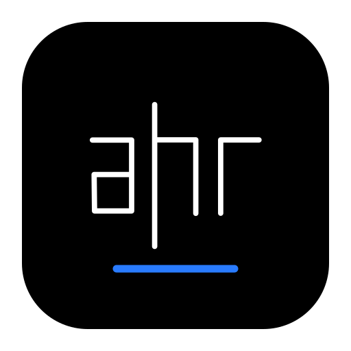

# AHR Foundation

<p align="center">
  
</p>

[](https://github.com/AHRConsulting/Ahr.Foundation/actions/workflows/ci.yml)
[](https://github.com/AHRConsulting/Ahr.Foundation/actions/workflows/release.yml)
[](https://github.com/AHRConsulting/Ahr.Foundation/actions/workflows/docs.yml)
[](https://www.nuget.org/packages/Ahr.Foundation)
[](https://www.nuget.org/packages/Ahr.Foundation)
[](LICENSE)


**AHR Foundation** by **AHR Consulting** provides platform-neutral, allocation-conscious correctness primitives for .NET under the technical identity `Ahr.Foundation`.

## Packages

`Ahr.Foundation` contains `readonly record struct` implementations of `Result`, `Result<T>`, `Result<T,TError>`, `Error`, and `Option<T>`. It targets .NET Standard 2.0 and .NET 10. The package also delivers `Ahr.Foundation.Analyzers`; diagnostic `AHRF001` prevents detectable default construction of result values, diagnostic `AHRF002` flags a manual try/catch that duplicates `Result.Try`/`Result.TryAsync`, diagnostic `AHRF003` flags a synchronous `Result.Try` call whose delegate discards an awaitable, suggesting `Result.TryAsync` instead, and diagnostic `AHRF004` flags an async delegate explicitly typed or cast as `Action` and passed to `Result.Try`, since such a delegate is async-void and can leak unobserved exceptions.

```bash
dotnet add package Ahr.Foundation --version 0.1.1
```

```csharp
using Ahr.Foundation;

Result<int> result = Result<int>.Success(21).Map(value => value * 2);
string text = result.Match(value => $"Value: {value}", error => error.Message);
```

Result values must be created with `Success` or `Failure`. A default-initialized result has an explicit uninitialized state and every inspection or composition operation throws `InvalidOperationException`. `Option<T>.None` remains safely default-initialized. Result and option factories reject null payloads or errors; composition methods also reject null delegates, tasks, and task results.

Composition uses `Map` when your function returns a plain value and `Bind` when it returns another `Result` or `Option` of the corresponding family. `MapError` transforms a failure without changing a success, while `Ensure` and `Where` validate successful values in the result and option families respectively. `ToOption` and `ToResult` convert between the two models when needed, and `GetValueOrDefault()`/`GetValueOrDefault(fallback)` extract the success value (or `default(T)`/`fallback` on failure) without an explicit `IsSuccess` check. `OrElse(fallback)`/`OrElse(Func<fallback>)`/`OrElseAsync(Func<Task<fallback>>)` return the original success/`Some` unchanged, or fall back to another `Result`/`Option` of the same type (eagerly, lazily, or asynchronously) on failure/`None`. `TaskCompositionExtensions` provides an `OrElseAsync` overload for `Task<Result>`/`Task<Result<T>>`/`Task<Result<T, TError>>`/`Task<Option<T>>`, so it can be chained directly off an unawaited task alongside `BindAsync`/`MapAsync`. LINQ query syntax is also supported, which suits pipelines where later steps need values bound earlier:

```csharp
Result<decimal> total =
    from user in FindUser(userId)
    from cart in LoadCart(user)
    select cart.Total;
```

If any step fails the rest are skipped and the original error is returned. Query syntax is synchronous; use `BindAsync`/`MapAsync` for `Task`-based pipelines.

Async composition is Task-based for `Result`, `Result<T>`, `Result<T,TError>`, and `Option<T>`. Adapt framework APIs returning `ValueTask<T>` at the boundary with the framework method `ValueTask<T>.AsTask()`:

```csharp
Task<Result<int>> task = result.BindAsync(value => LoadAsync(value).AsTask());
```

At I/O and interop boundaries, `Result.Try`/`Result.TryAsync` convert an exception thrown by an operation into a `Failure` instead of a repeated try/catch:

```csharp
Result<Customer> customer = await Result.TryAsync(() => repository.GetCustomerAsync());

Result<Customer, DomainError> withCustomError = await Result.TryAsync(
    () => repository.GetCustomerAsync(),
    ex => DomainError.FromException(ex));
```

`OperationCanceledException` always propagates unchanged; the custom-error overloads require an explicit `Func<Exception, TError>` error factory, while the built-in-`Error` overloads use `Error.FromException` automatically.

## Build

```bash
dotnet format Ahr.Foundation.slnx --verify-no-changes
dotnet build Ahr.Foundation.slnx -c Release
dotnet test --solution Ahr.Foundation.slnx -c Release --no-build
dotnet run --project samples/Ahr.Foundation.Samples
dotnet pack src/Ahr.Foundation/Ahr.Foundation.csproj -c Release --no-build -o artifacts/packages
```

Set `AhrFoundationVersion` to a SemVer 2.0-compatible value when validating a future release, for
example `-p:AhrFoundationVersion=0.2.0`.

To verify the packed artifact through the sample application rather than a project reference:

```bash
scripts/verify-package.sh 0.1.1
```

The repository includes reproducible BenchmarkDotNet baselines for `Result` and `Option`. Run all
benchmarks:

```bash
dotnet run -c Release --project benchmarks/Ahr.Foundation.Benchmarks
```

Construction and most synchronous composition paths are designed to avoid managed allocations.
Task-based async composition is measured separately and can incur normal `Task` and state-machine
allocations. See the [performance guide](docs/performance.md) and [benchmark
instructions](benchmarks/README.md) for filtered commands, methodology, and interpretation.

## Documentation and Samples

- **Guide**: Start with the [overview and guide](docs/index.md) for composition patterns and LINQ query syntax.
- **Analyzers**: Review the [bundled Roslyn rules](docs/analyzers.md), their severities, and remediation examples.
- **Performance**: Review the [benchmark scope and methodology](docs/performance.md), which also
  covers NativeAOT and trimming compatibility.
- **API Reference**: Generated from XML documentation comments with DocFX ([`docfx.json`](docfx.json)) and published by the [Deploy Docs](.github/workflows/docs.yml) workflow.
- **Samples Project**: Runnable domain flows in [`samples/Ahr.Foundation.Samples`](samples/Ahr.Foundation.Samples).
- **Release Workflow**: [`.github/workflows/release.yml`](.github/workflows/release.yml) builds and
  verifies tagged releases before publishing to NuGet.org through a protected environment.
- **Agent skill**: [AHRConsulting/agent-skills](https://github.com/AHRConsulting/agent-skills) provides an installable `ahr-foundation` skill for the ROP conventions above.

## Versioning and scope

`0.1.1` is a stable NuGet release, not a prerelease. The `0.x` major version signals that feedback-driven API changes may still occur before `1.0.0`; breaking changes will be documented in the changelog and indicated by a minor-version increase.

The package remains intentionally focused on platform-neutral `Result`, `Option`, and directly related composition helpers. New helpers are evaluated against real consumer requirements rather than expanding this into a general-purpose core library.

## License

Licensed under the Apache License, Version 2.0. See [LICENSE](LICENSE).

## Security and contribution

See [SECURITY.md](SECURITY.md), [SUPPORT.md](SUPPORT.md),
[CONTRIBUTING.md](CONTRIBUTING.md), and [CODE_OF_CONDUCT.md](CODE_OF_CONDUCT.md).
